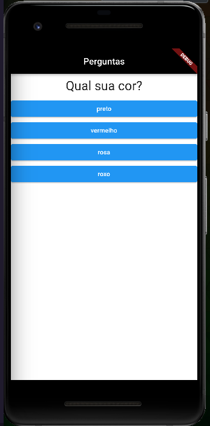
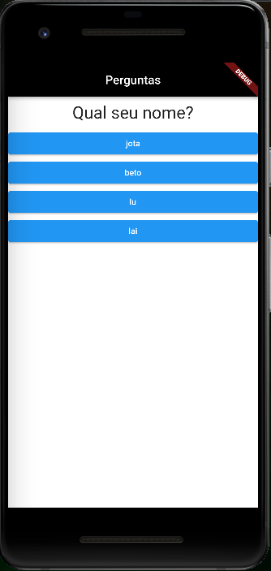
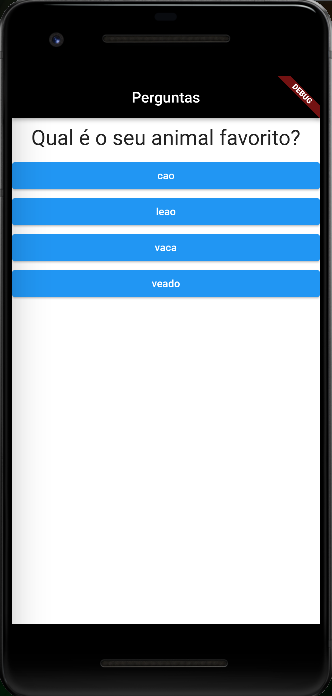
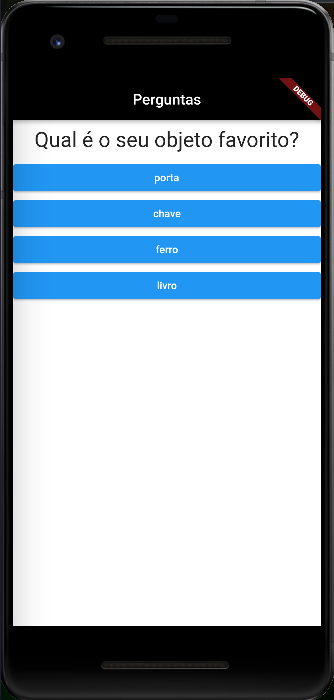
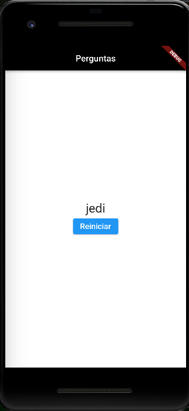

# Perguntas App

Projeto desenvolvido no curso de flutter da Cod3r.

>

Prática de conceitos básicos com o framework.

## Versão Usada

- sdk: >=2.18.2 <3.0.0
- Flutter: 3.3.5
- Dart: 2.18.2
- DevTools: 2.15.0
- openjdk 11.0.16

## Screens

.
.
.
.
.
